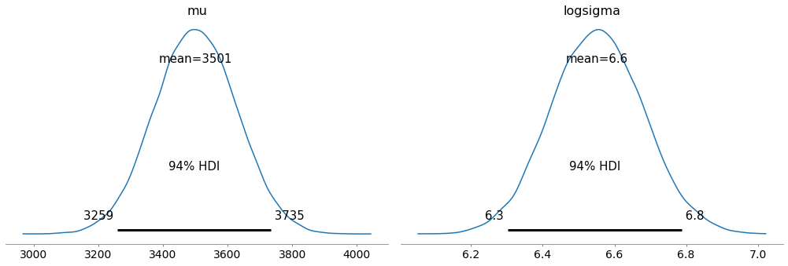
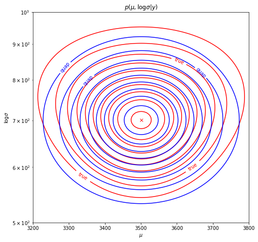

# pymc3-quap

The quadratic approximation is a very fast method to approximate the posterior with a multivariate normal. 

NOTE: The quadratic approximation only works well if the posterior is uni-modal and roughly symmetrical. 

### Example

```python
import numpy as np
import pymc3 as pm
import arviz as az
from quap import quap
y = np.array([2642, 3503, 4358]*10)

# Normal with unknown mean and log-variance, with uniform priors 
with pm.Model() as m: 
  logsigma = pm.Uniform("logsigma", -100, 100)
  mu = pm.Uniform("mu", -10000, 10000) 
  yobs = pm.Normal("y", mu=mu, sigma=pm.math.exp(logsigma), observed=y)
  idata, posterior = quap([mu, logsigma])

az.plot_posterior(idata)
```



`idata` is an `arviz.InferenceData` with samples from the approximate posterior for compatibility with the Arviz ecosystem.
 
`posterior` is the exact approximate posterior `scipy.stats.multivariate_normal`

   

True posterior and quadratic approximation for the example above.

### Install

`pip install pymc3-quap`